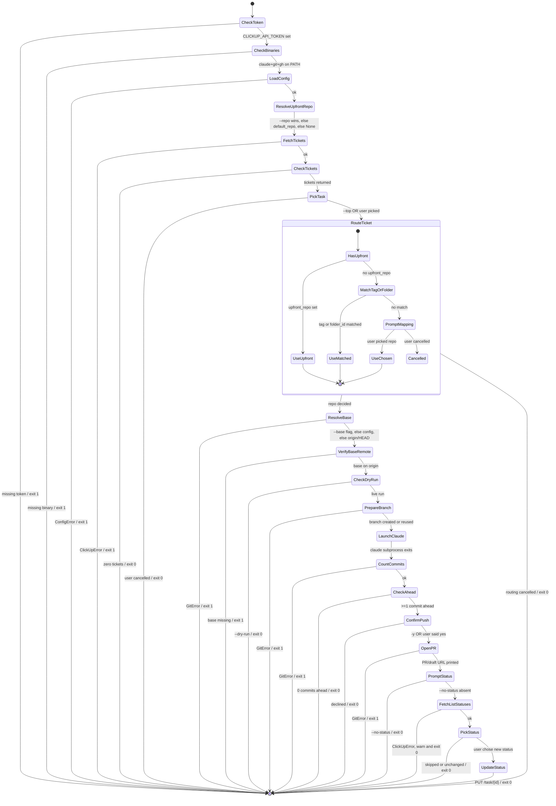
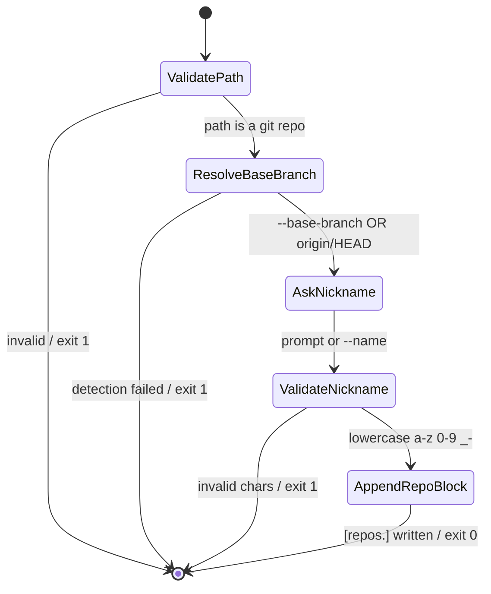

# clickup-work flow

State diagram of the runtime behaviour, traced from `clickup_work/cli.py`.
Render on GitHub directly, in any Mermaid-aware editor, or by pasting the
block below into <https://mermaid.live>. To produce an SVG/PNG locally:

```bash
npx -y @mermaid-js/mermaid-cli -i docs/flow.md -o flow.svg
```

## Default command — `clickup-work [...flags]`



## Subcommand — `clickup-work add-repo <path>`



## State legend

| State                | Source                                | Notes                                                              |
|----------------------|----------------------------------------|--------------------------------------------------------------------|
| `CheckToken`         | `cli.py:594-600`                      | Reads `CLICKUP_API_TOKEN` env var.                                |
| `CheckBinaries`      | `cli.py:602-604`, `_check_binaries`   | `claude`, `git`, `gh` must be on `PATH`.                          |
| `LoadConfig`         | `config.load`                         | Parses `~/.config/clickup-work/config.toml`.                      |
| `ResolveUpfrontRepo` | `cli.py:_resolve_upfront_repo`        | `--repo` > `default_repo` > single-repo > None.                   |
| `FetchTickets`       | `clickup.get_open_tasks`              | `GET /team/{id}/task` with `include_closed=false`.                |
| `PickTask`           | `cli.py:pick_task`                    | fzf if available, else numbered prompt.                           |
| `RouteTicket`        | `cli.py:_route_ticket` + prompt       | Tag matches beat folder matches.                                   |
| `ResolveBase`        | `cli.py:_resolve_base_branch`         | `--base` > config > `origin/HEAD`.                                 |
| `VerifyBaseRemote`   | `git.remote_branch_exists`            | Pre-flight before any local mutation.                              |
| `PrepareBranch`      | `git.prepare_branch`                  | Reuses existing branch instead of resetting.                       |
| `LaunchClaude`       | `claude.launch`                       | Blocking subprocess; resumes after Claude exits.                   |
| `CountCommits`       | `git.commits_ahead`                   | Skips push when zero.                                              |
| `OpenPR`             | `git.push_and_open_pr`                | Honours `--draft`.                                                 |
| `PromptStatus`       | `cli._prompt_status_change`           | Calls `GET /list/{id}` then `PUT /task/{id}`.                      |
