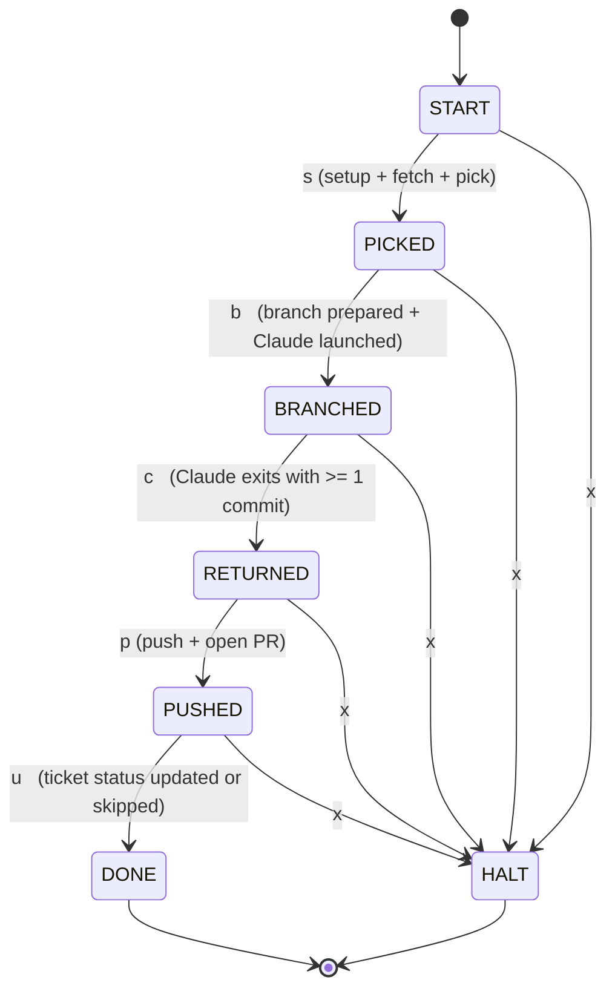

# clickup-work — DFA

A deterministic finite automaton that describes one run of `clickup-work`.
Each state is a checkpoint the program reaches; each edge is the single
event that moves it forward. Anything that fails on any edge sends the
machine to `HALT`.

## Diagram

## Formal definition

**States** `Q = { START, PICKED, BRANCHED, RETURNED, PUSHED, DONE, HALT }`
**Start** `q0 = START`
**Accept** `F = { DONE }` (HALT is a reject sink)

**Alphabet** `Σ`

| Symbol | Meaning                                                        |
|:------:|----------------------------------------------------------------|
| `s`    | env + binaries + config ok, ticket fetched, ticket+repo picked |
| `b`    | base branch verified, feature branch prepared, Claude launched |
| `c`    | Claude exits and the branch has at least one new commit        |
| `p`    | branch pushed and PR (or draft PR) opened on GitHub            |
| `u`    | ClickUp ticket status updated, or user skipped the prompt      |
| `x`    | any error, user cancel, `--dry-run`, or zero commits           |

**Transition function** `δ`

| From       | Input | To         |
|------------|:-----:|------------|
| `START`    | `s`   | `PICKED`   |
| `PICKED`   | `b`   | `BRANCHED` |
| `BRANCHED` | `c`   | `RETURNED` |
| `RETURNED` | `p`   | `PUSHED`   |
| `PUSHED`   | `u`   | `DONE`     |
| any        | `x`   | `HALT`     |

The only accepting run is `s · b · c · p · u`. Every other run halts.
