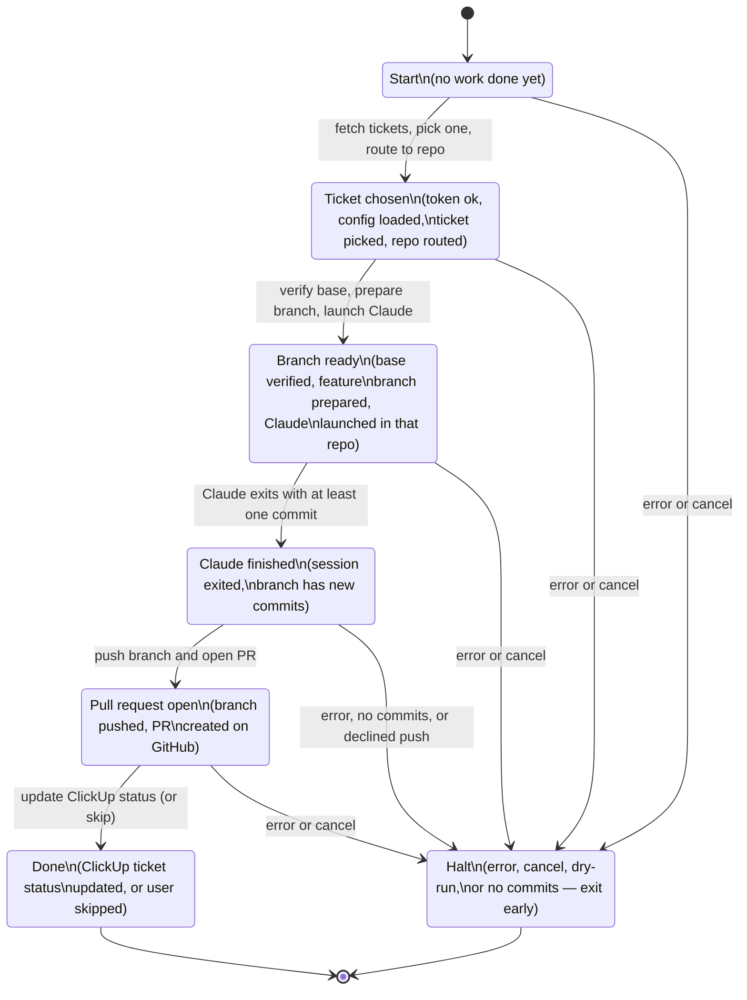

# clickup-work — finite state diagram

One run of `clickup-work`, expressed as a finite state machine. Each box is
a state the program is in; each arrow is the event that moves it to the
next state. Every state has one escape hatch labelled "error or cancel"
that leads to `Halt`.

## How to read it

- The happy path runs straight down the middle:
  `Start → Ticket chosen → Branch ready → Claude finished → PR open → Done`.
- Every state has the same fallback: anything that goes wrong (network
  error, user pressing Ctrl-C, `--dry-run` stopping the run, no commits to
  push) sends the program to `Halt` and the process exits.
- `Done` is the only accepting state. Everything else either keeps moving
  forward or halts.
